<div align="center">

# cc-mascot

**Anime desktop mascots for Claude Code**

 

A tiny Hatsune Miku lives on your desktop and shows what Claude Code is doing:
thinking, working, waiting on you, cheering when it is done, upset when
something fails. Or [Yunseul](#meet-yunseul), a sleepy little vampire doll
with a gothic style all her own.

<sub>Windows only · an unofficial fan project, not made by or affiliated with Anthropic or Crypton Future Media</sub>

</div>

## What she does

Every Claude Code session gets its own Miku. She beams in as a concert
hologram when the session starts, reacts to everything Claude does, and
dissolves into bits and notes when the session ends.

<table>
<tr>
<td align="center">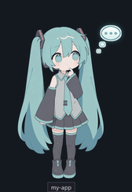<br><b>thinking</b><br><sub>working out an answer</sub></td>
<td align="center">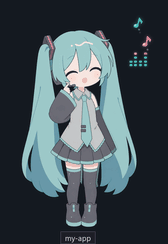<br><b>working</b><br><sub>a tool is running</sub></td>
<td align="center">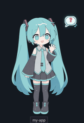<br><b>waiting</b><br><sub>Claude needs you</sub></td>
<td align="center">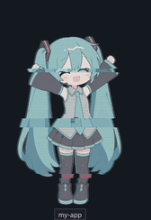<br><b>happy</b><br><sub>all done</sub></td>
</tr>
<tr>
<td align="center">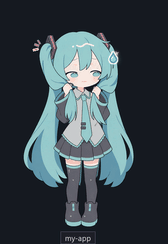<br><b>worried</b><br><sub>the API went quiet</sub></td>
<td align="center">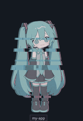<br><b>error</b><br><sub>something failed</sub></td>
<td align="center">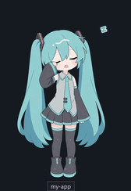<br><b>sleepy</b><br><sub>idle for 5 minutes</sub></td>
<td align="center">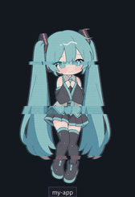<br><b>held</b><br><sub>while you carry her</sub></td>
</tr>
</table>

### Miku Miku Beam!

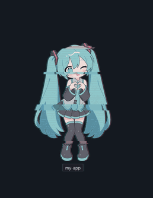

When a big job finishes (two minutes or more of work, or one that used
subagents or background agents), she skips the usual cheer and fires her
beam: sparkles spiral into her heart hands, then hearts burst out at you
with manga speed lines and a ミクミクビーム! banner. `/mascot beam` fires it
whenever you like.

<br clear="right">

| Mood | When |
| --- | --- |
| idle | Nothing running. |
| thinking | After your message, between tool calls, and while the conversation compacts. |
| working | A tool runs (reads, commands, edits), or Claude waits on work it started: subagents, a build, a monitor. |
| waiting | A permission prompt, a question for you, or a plan to approve. |
| worried | A request has streamed nothing for 10 s: usually an API retry or a dropped connection. |
| happy | Everything is finished: the reply and all the work it waited on. |
| beam | Instead of happy, when the work took 2+ minutes or used subagents or background agents. |
| error | A tool failed, or a reply ended on an error. Declining a prompt doesn't count. |
| sleepy | Idle for 5 minutes. |

### Cursor magic

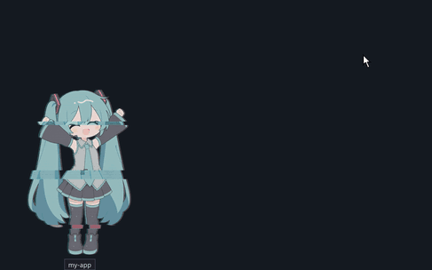

Off by default. Turned on, a job that ran a while ends with her sending
magic to your mouse pointer, wherever it is, even on another display: a
star flies from her hands, bursts on the pointer, and notes and a heart
circle it until you click. It goes whatever window is active, since that
says nothing about where you're looking (a video on one display, the
terminal on the other). It only waits while a fullscreen game or a
presentation is on. Clicks pass right through it, and it never takes the focus from
what you're typing in. Turn it on in the settings window, or with
`/mascot magic after 1` (minutes; `0` for every job). `/mascot magic` sends
one to try it.

<br clear="right">

### She keeps an eye on your session

Long sessions and usage limits show on her too, whatever her mood:

<table>
<tr>
<td align="center">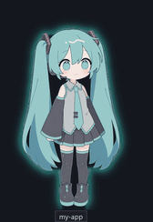<br><b>300k context</b><br><sub>a teal aura</sub></td>
<td align="center">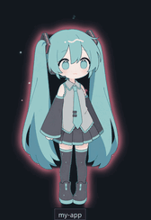<br><b>400k</b><br><sub>pink, with sparkles</sub></td>
<td align="center">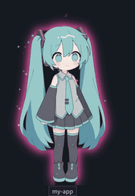<br><b>500k</b><br><sub>overload: time to <code>/compact</code></sub></td>
</tr>
<tr>
<td align="center">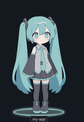<br><b>5-hour limit at 90%</b><br><sub>a failing stage light</sub></td>
<td align="center">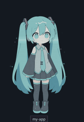<br><b>weekly limit at 90%</b><br><sub>a fading hologram</sub></td>
<td></td>
</tr>
</table>

Hover over her for a card with the details: context used and how fast it
grows (with an estimate of the turns left before auto-compact), your 5-hour
and weekly limits, the model, what Claude is doing and for how long, and each
subagent's context.

### Sounds, if you like

Off until you turn them on (`/mascot sound on`, or the settings window).
Then she chimes once she has waited on you for 30 seconds, cheers when the
work is done, plays a fanfare for her beam and a soft "uh-oh" when a turn
fails. Cursor magic and her coming and going can have a sound too. Miku's
are bright glass and synth sparkles; Yunseul's a music box, low bells and
an organ. Every sound is original, made in code for this plugin. Any moment
can play a sound of your own instead (a `.wav` or `.mp3`, up to 8
seconds). She is quiet while hidden or while your screen is off or locked,
and two mascots never talk over each other.

### She lets you know

Three more ways she tells you what is going on, each off until you turn it
on in the settings window's Notifications page, and each in her own style:
Miku's messenger is a little phone, Yunseul's a bat carrying a letter
sealed in crimson wax.

- **Call me**: when she has waited on you for 30 seconds, her messenger
  calls and her terminal blinks in the taskbar. Click her to bring her
  terminal forward.
- **Remote Control**: a prompt you send from the Claude app on your phone,
  the web or a chat comes in with her messenger.
- **Away notes**: step away, and she keeps a note of what happened (work
  done, a turn that failed, waiting on you). When you are back, she holds
  it at her feet; hover her to read it.

### Playing with her

- **Drag** her anywhere, on any display. She goes shy, legs dangling, swings
  from where you hold her and lands with a little bounce. Each spot
  remembers where you put her.
- **Click** her to bring her terminal forward (with Call me on).
- **Double-click** sends her back to her spot.
- **Right-click** hides her.
- Several sessions stand side by side, never on top of each other, each with
  a tag naming its project.

## Meet Yunseul

Yunseul is a sleepy little vampire doll from Inhyeong RPG, in gothic lolita
black and crimson. She has her own moods and her own effects throughout:
bats instead of notes, lace bubbles, a needle sewing cross stitches while
Claude works, a little ghost when she is worried. She arrives through a
summoning circle with candles and mist, forming out of smoke, and leaves in a
burst of bats. Pick her with `/mascot character yunseul`, or in the settings
window.

<table>
<tr>
<td align="center">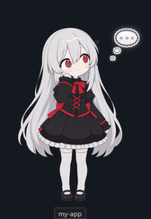<br><b>thinking</b><br><sub>a lace bubble</sub></td>
<td align="center">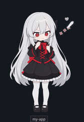<br><b>working</b><br><sub>sewing cross stitches</sub></td>
<td align="center">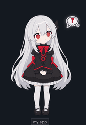<br><b>waiting</b><br><sub>a bat peeking in</sub></td>
<td align="center"><br><b>happy</b><br><sub>roses and bats</sub></td>
</tr>
<tr>
<td align="center">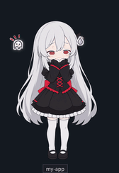<br><b>worried</b><br><sub>a trembling ghost</sub></td>
<td align="center">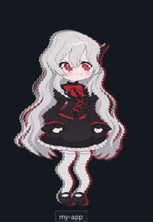<br><b>error</b><br><sub>a pouty tantrum</sub></td>
<td align="center">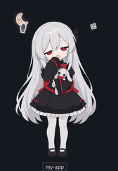<br><b>sleepy</b><br><sub>yawning with her bunny</sub></td>
<td align="center"><br><b>held</b><br><sub>while you carry her</sub></td>
</tr>
</table>

### Love Bite

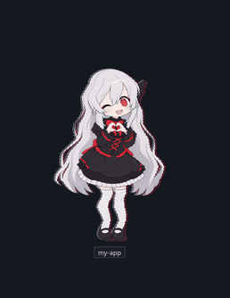

Her big finish: bats spiral into her heart hands, then stitched hearts and
a swarm of bats burst out at you, with crimson rays, a shockwave and a
러브 바이트! banner on bat wings.

Her cursor magic is a silver glint trailing petals and bats, roses bursting
on the pointer, two bats and a stitched heart circling it.

<br clear="right">

Her warnings are her own too:

<table>
<tr>
<td align="center"><br><b>300k context</b><br><sub>moonlight</sub></td>
<td align="center">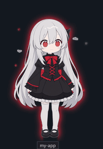<br><b>400k</b><br><sub>crimson, petals and bats</sub></td>
<td align="center">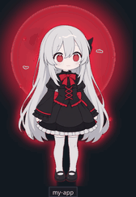<br><b>500k</b><br><sub>a blood moon beating</sub></td>
</tr>
<tr>
<td align="center"><br><b>5-hour limit at 90%</b><br><sub>candles guttering</sub></td>
<td align="center">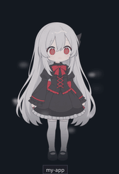<br><b>weekly limit at 90%</b><br><sub>fading into a ghost</sub></td>
<td></td>
</tr>
</table>

## Install

You need **Windows** and **Python 3 with Pillow** (`pip install pillow`).
`pythonw` must be on your `PATH` (the Microsoft Store Python and the
python.org installer with "Add to PATH" both do that).

1. In Claude Code, add this repository as a plugin marketplace and install
   the plugin:

   ```
   /plugin marketplace add desuqcafe/cc-mascot
   /plugin install mascot@cc-mascot
   ```

   (Or from a terminal: `claude plugin marketplace add desuqcafe/cc-mascot`,
   then `claude plugin install mascot@cc-mascot`.)

2. Start a new session (or type `/reload-plugins`). She beams in at the
   bottom-right of your main display.

To get new versions on their own, turn on auto-update for the marketplace:
`/plugin`, the **Marketplaces** tab, `cc-mascot`, **Enable auto-update**.

<details>
<summary>Or from a clone</summary>

```
git clone https://github.com/desuqcafe/cc-mascot.git
```

Then load its `mascot` folder for every session, in `~/.claude/settings.json`:

```json
{
  "env": {
    "CLAUDE_CODE_PLUGIN_DIRS": "C:\\path\\to\\cc-mascot\\mascot"
  }
}
```

Or for one session: `claude --plugin-dir C:\path\to\cc-mascot\mascot`.
Updating a clone is a `git pull` (`/mascot update` does it for you).

</details>

## Updates

A new version greets you: the first time it runs, she holds up a "NEW!"
banner with its version (Yunseul's has bat wings) and Claude Code shows
what is new. Skipped a few versions? `/mascot news` lists everything since
the one you had, and **What's new in every version** in the settings
window shows every version's news.

To hear about one before you have it, turn on **Look for new versions** in
the settings window (or `/mascot updates on`). It is off by default; on, the
plugin reads this repository's version number once a day, and when there is
a newer one, her hover card says so and the window offers an **Update**
button. The button, or `/mascot update`, updates her the way she was
installed (`claude plugin update` for the marketplace, `git pull` for a
clone); type `/reload-plugins` afterwards to meet her new version.

## Commands

| Command | What it does |
| --- | --- |
| `/mascot` | Show or hide this session's mascot. New sessions start the way you last chose. |
| `/mascot show`, `/mascot hide` | Say which. |
| `/mascot show all`, `/mascot hide all` | Every session at once. |
| `/mascot character` | List the characters with art. |
| `/mascot character NAME` | Pick one for this project's sessions. |
| `/mascot beam` | Miku Miku Beam! (or Yunseul's Love Bite) |
| `/mascot settings` | Open the settings window. |
| `/mascot size [small\|normal\|large\|PX]` | Her height: 300, 420 (default) or 560 px, or 240 to 640. |
| `/mascot calm [on\|off]` | Calm mode: no glitch, particles, flicker or flashes. |
| `/mascot aura [A B C\|off]` | When her aura's three levels start (default `300k 400k 500k`), or no aura. |
| `/mascot beam after [MINUTES\|never]` | How long a job runs before it ends in the beam (default 2). |
| `/mascot beam agents [on\|off]` | Whether jobs with subagents or background agents end in it too. |
| `/mascot magic` | Send cursor magic to your pointer now, to try it. |
| `/mascot magic after [MINUTES\|never]` | How long a job runs before its end sends magic to your pointer (0 for every job; off by default). |
| `/mascot updates [on\|off]` | Look for a new version once a day (off by default). |
| `/mascot update` | Update her to the newest version. |
| `/mascot news [all]` | What is new since the version you had before (`all`: every version). |
| `/mascot sound [on\|off]` | Her sounds (off by default); with no value, what each moment plays. |
| `/mascot sound volume [0-100]` | Their volume (60). |
| `/mascot sound MOMENT [on\|off\|default\|FILE]` | What a moment plays (`waiting`, `done`, `beam`, `error`, `magic`, `intro`, `outro`): her own, nothing, or your file in `~/.claude/mascot/sounds/`. |
| `/mascot sound try MOMENT` | Hear a moment's sound now. |
| `/mascot reset` | Every setting back to its default. |

## Settings

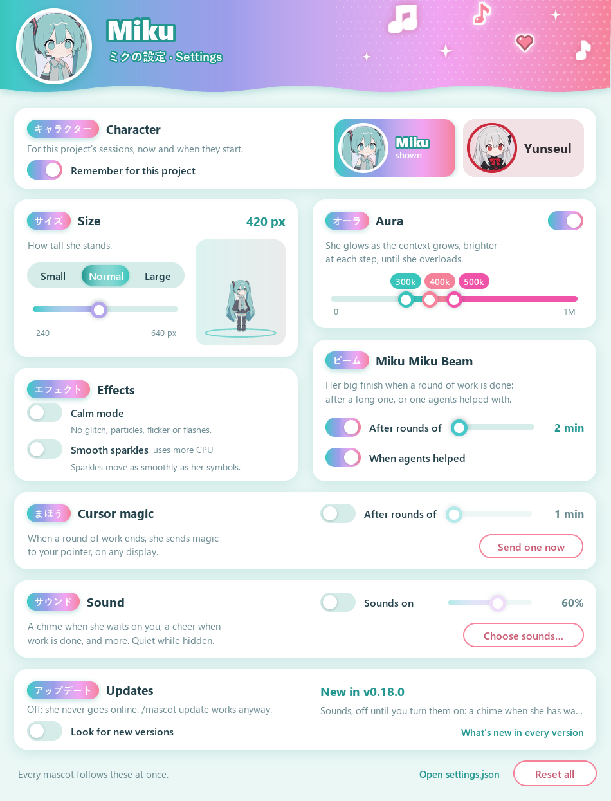 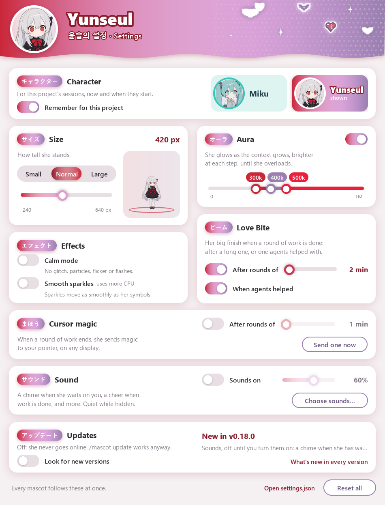

The window picks her character too: click a character to switch this
session's mascot. With "Remember for this project" on (the default), the
project's next sessions get her as well; off, only this session switches.
The window takes on her colors as you pick.

Everything else starts out as described above; the settings are there if you
want her smaller, calmer, or glowing at other points. They apply to every
mascot at once, live, from the window, the commands above, or
`~/.claude/mascot/settings.json` by hand.

## Good to know

- Nothing leaves your machine: no API calls, and no network at all unless
  you turn on **Look for new versions** (then one read of this repository's
  version number a day, nothing sent) or ask for an update. The plugin
  writes a small status file per session and the overlay reads it.
- She can never break a session: the plugin only watches events and never
  changes what Claude does.
- A hidden mascot uses about 20 MB of memory; a shown one about 125 MB and a
  few percent of one CPU core on a typical desktop (nearly twice the memory at
  the largest size).

## Under the hood

- [`mascot/`](mascot/) is the plugin: a hooks module turns Claude Code's
  events into a mood, and a Python overlay draws her into a per-pixel-alpha
  window. Its [README](mascot/README.md) has the full details.
- [`rig/`](rig/) turns layered art into the looping animations (breathing,
  blinking, hair and skirt sway). See its [README](rig/README.md).
- [`art/`](art/) holds the source art.
- [`docs/make_gifs.py`](docs/make_gifs.py) renders the GIFs on this page with
  the overlay's own drawing code (`--character yunseul` for hers).

## Roadmap

Plans, not promises:

- **Optional extras**: hide her while a fullscreen app is on her display.
- **More characters**, each with their own moods, colors and effects.

## License and credits

The code is [MIT](LICENSE). The character art is not (see
[`art/NOTICE.md`](art/NOTICE.md)): Hatsune Miku is © Crypton Future Media,
INC. ([piapro.net](https://piapro.net)), and her art here is non-commercial
fan art under the [Piapro Character License](https://piapro.net/intl/en_for_creators.html).
Yunseul is © desuqcafe, from the author's game Inhyeong RPG (in
development), all rights reserved.

The animation rig splits the art into layers with
[See-through](https://github.com/shitagaki-lab/see-through) (Lin et al.,
SIGGRAPH 2026, Apache-2.0).

cc-mascot is an unofficial fan project, not made by or affiliated with
Anthropic or Crypton Future Media.
